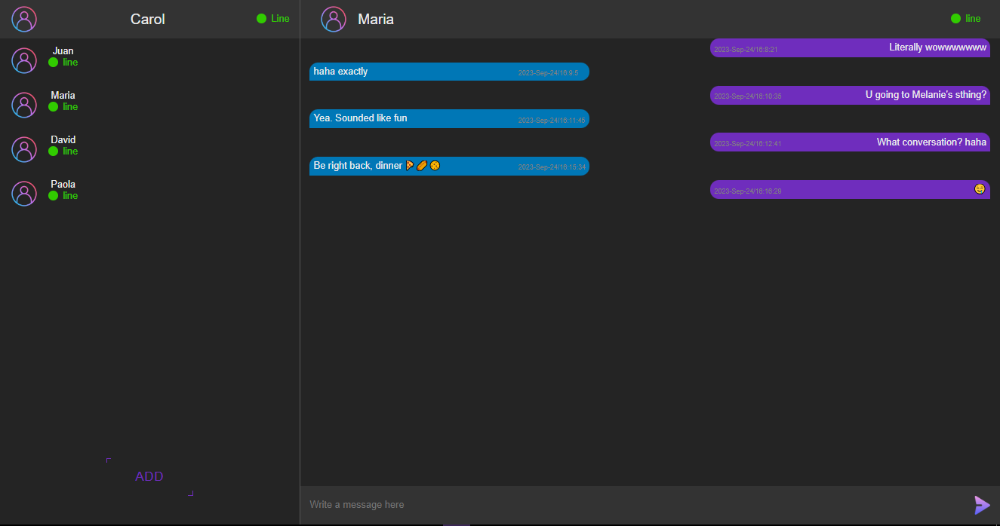

<h1>Chat en tiempo real</h1>

<a href="https://jdmcpokedex.surge.sh" target="_blank">
    
    
Chat de tiempo real

</a>

Este proyecto consiste en una aplicación de chat en tiempo real desarrollada desde cero, donde se utilizó React.js para construir el frontend y Node.js con las bibliotecas Express, Mongoose y Socket.io para crear el backend. La base de datos se implementó utilizando MongoDB. Esta aplicación permite a los usuarios interactuar en tiempo real a través de mensajes instantáneos, ofreciendo una experiencia de chat fluida y eficiente.
